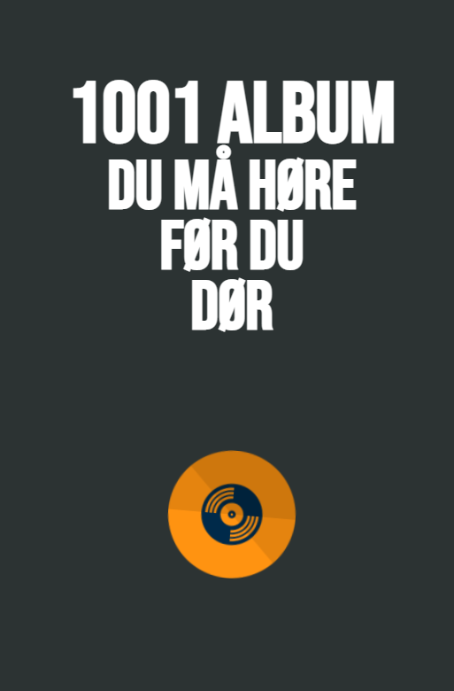

# 1001albums

\
This project is made for archiving and keeping track of Mari and Sebs rating to the albums in '1001 albums you must hear before you die'. All these ratings are highly subjective. The application is made in react⚛️

#### Test in your browser 💿 
<a href="https://1001albums.netlify.app/" target="_blank">1001albums.netlify.app</a>\
This version will be updated whenever we listen to a new album. 

#### Download 💻
In the project directory, you can run:
`yarn start`

This runs the app in the development mode.\
Open [http://localhost:3000](http://localhost:3000) to view it in your browser.

The page will reload when you make changes.\
You may also see any lint errors in the console. 

#### Functionality 🤖
* [X] Dynamic sorting in album number, year and rating. 
* [X] Responsive for all platforms 
* [X] We can listen to a lot of new music 

 
